# SAP Joule Agent — Equipment Troubleshooting Agent

**Hands-On Copy-Paste Reference**

This README contains all the names, identifiers, descriptions, and instruction blocks you need during the hands-on. Follow the main hands-on guide for the UI steps — use this file to copy values into SAP Joule Studio. Screenshots are included under each step so you know which screen to match.

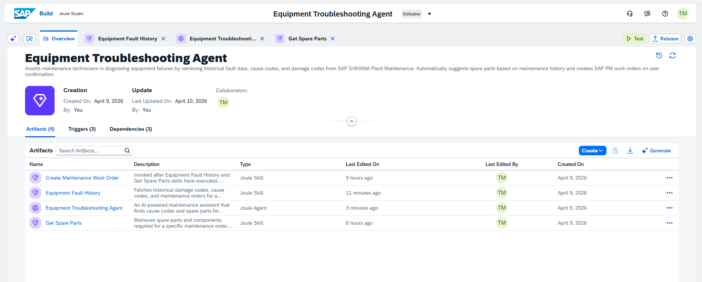

---

## Project

**Name**
```
Equipment Troubleshooting Agent XX
```

> Replace `XX` with your participant number or initials.

**Description**
```
Assists maintenance technicians in diagnosing equipment failures by retrieving historical fault data, cause codes, and damage codes from SAP S/4HANA Plant Maintenance. Automatically suggests spare parts based on maintenance history and creates SAP PM work orders on user confirmation.
```

### Step 1.1 — Objective screen

Select **Joule Agent and Skill** (third tile with the diamond icon).

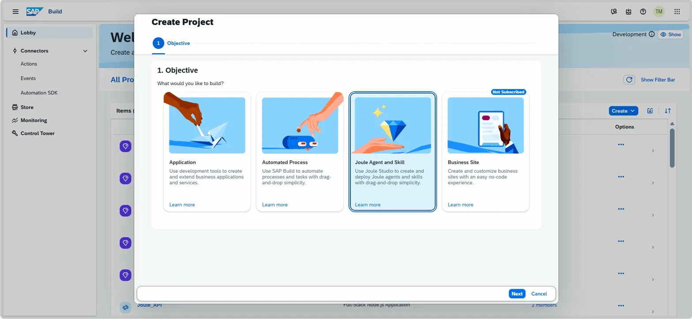

### Step 1.2 — Name screen

Paste the Name and Description from above.

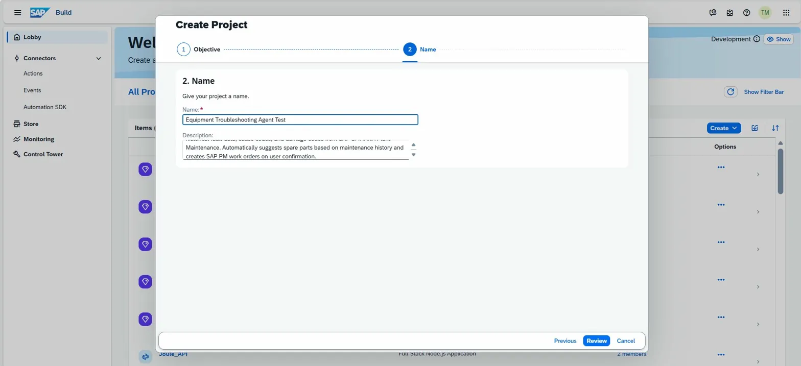

---

## Skill 1 — Equipment Fault History

**Name**
```
Equipment Fault History
```

**Identifier**
```
equipmentFaultHistory
```

**Description**
```
Fetches historical damage codes, cause codes, and maintenance orders for a specific equipment from SAP maintenance notifications. This skill is only invoked as part of the Equipment Troubleshooting agent flow. Do not use this skill standalone for user queries about cause codes or spare parts.
```

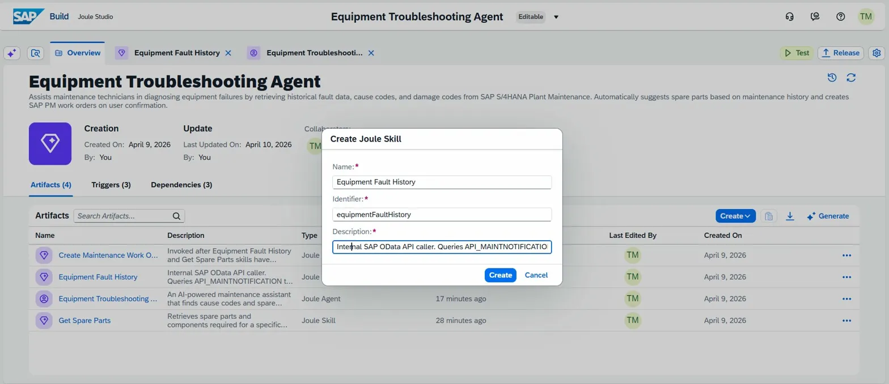

### 3.1 — Trigger the Start Node

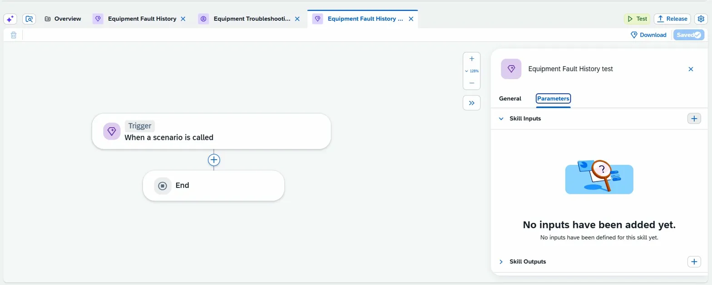

14. In the **General** tab, **Disable "Allow skill to be started directly by a user"** 
15. In the **parameters** tab — you will see 'Skill Inputs' and 'Skill Outputs' sections.
16. Click the + icon next to Skill Inputs.
17. The Configure Skill Inputs dialog opens.

### Skill Input

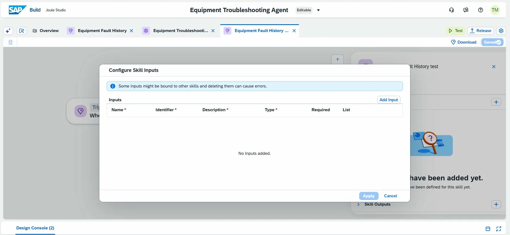

| Name | Identifier | Description | Type | Required | List |
| --- | --- | --- | --- | --- | --- |
| `equipment` | `equipment` | Equipment number to fetch fault history. | String | Yes | No |

**Input (copy)**
```
equipment
```
```
Equipment number to fetch fault history.
```

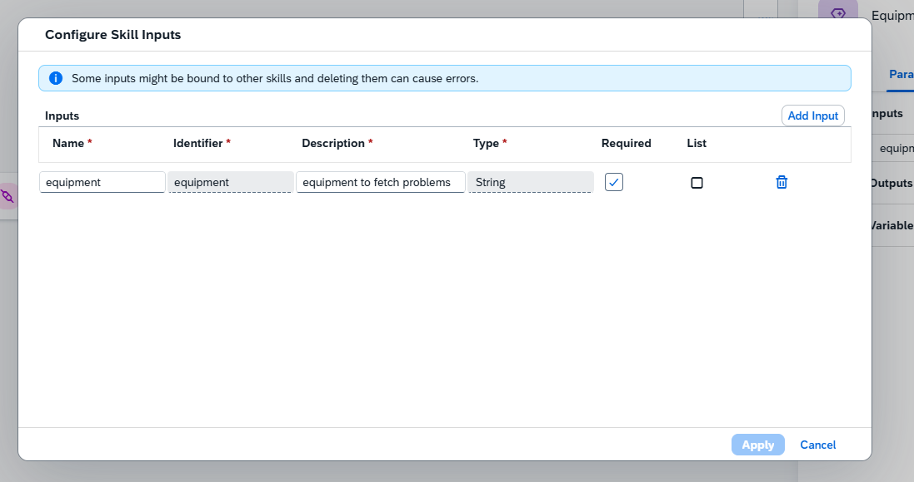

### Add Action — Call Action

Click the `+` between Trigger and End and select **Call Action**.

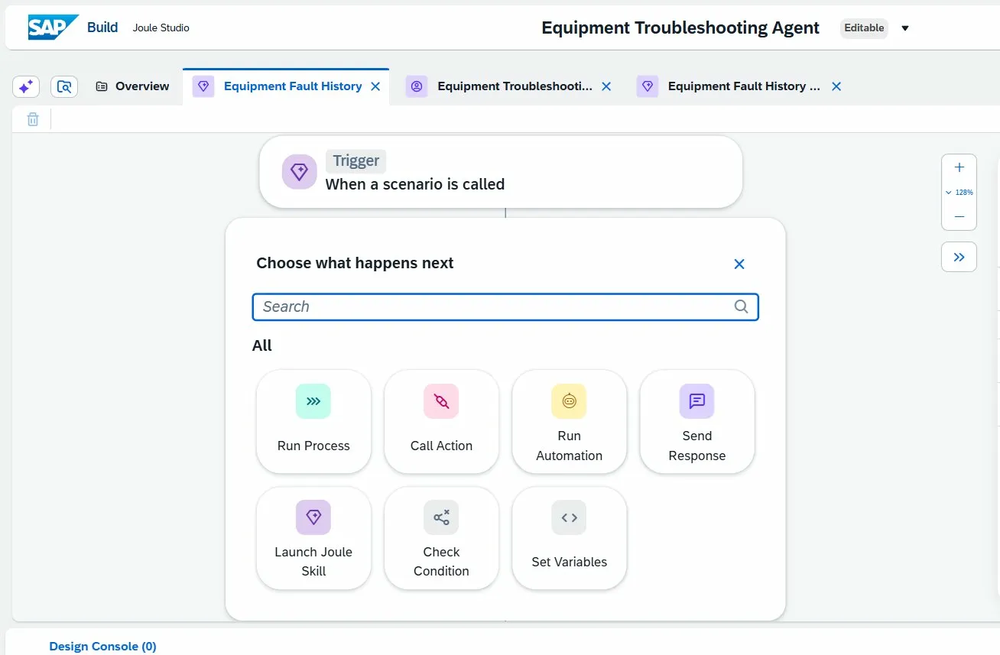

### Action — General tab

| Field | Value |
| --- | --- |
| Action Name | `Get fault history maintnotification` |
| Destination Variable | `odata_dest` |
| Destination | `S4H-210-Odata-Basic-Joule` |

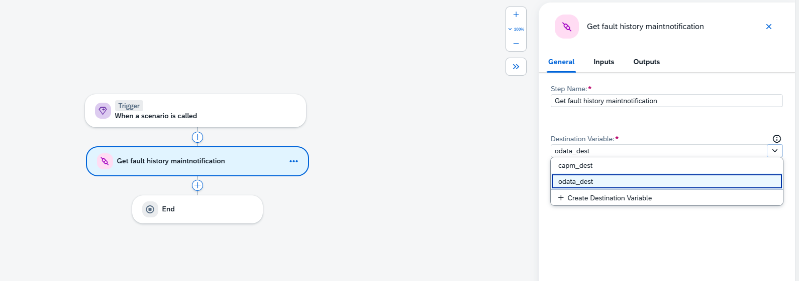

### Action — Inputs tab

| Action Input Parameter | Maps To (Skill Input) |
| --- | --- |
| `equipmentNumber` | `equipment` |

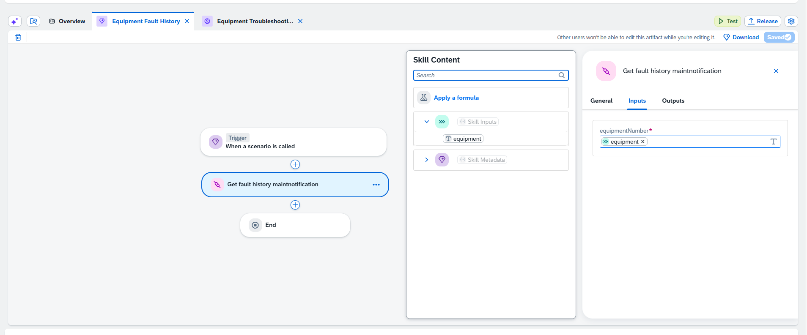

### Skill Outputs

Add these in the Start node → Parameters tab → Skill Outputs → click the edit (✏️) icon → **Add Output**.

| Name | Identifier | Description | Type | Required | List |
| --- | --- | --- | --- | --- | --- |
| `response` | `response` | response array | Any | Yes | **Yes** |
| `MaintNotifDamageCodeGroup` | `maintnotifdamagecodegroup` | Failure/Breakdown Type Category | String | Yes | No |
| `MaintNotifDamageCodeGroupName` | `maintnotifdamagecodegroupname` | Technician Damage Description | String | Yes | No |
| `MaintNotifCauseCodeGroupName` | `maintnotifcausecodegroupname` | Root Cause Category Code | String | Yes | No |
| `MaintNotificationCauseCodeName` | `maintnotificationcausecodename` | Equipment Failure Reason | String | Yes | No |
| `MaintNotifDamageCodeName` | `maintnotifdamagecodename` | Damage category group code | String | Yes | No |
| `MaintNotificationDamageCode` | `maintnotificationdamagecode` | Specific damage code record | String | Yes | No |
| `maintenanceOrder` | `maintenanceorder` | The maintenance order to retrieve | String | Yes | No |

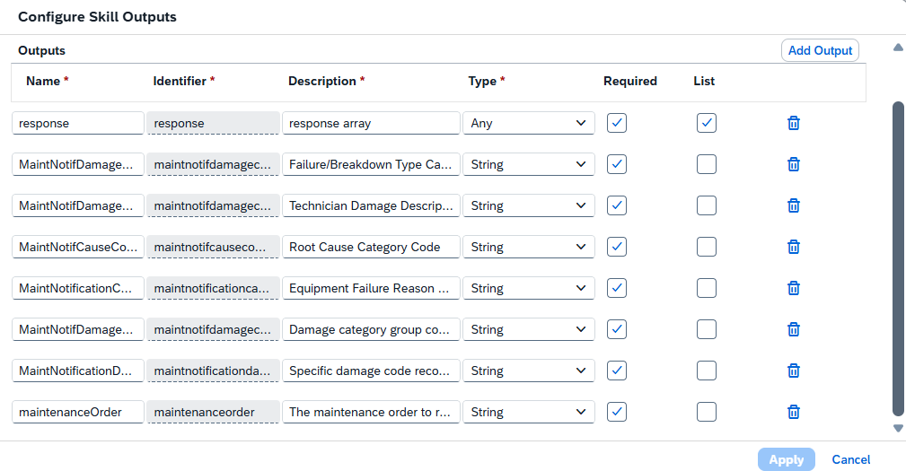

> ⚠️ `response` must be **Type: Any** and **List: Yes** (checkbox). All other outputs are Type: String, List: No.

### Output → Response Tree Mapping (End Node)

| Skill Output | Click this in the Skill Content tree |
| --- | --- |
| `response` | `list - results` (root) |
| `MaintNotifDamageCodeGroup` | list - results → MaintNotifDamageCodeGroup |
| `MaintNotifDamageCodeGroupName` | list - results → MaintNotifDamageCodeGroupName |
| `MaintNotifDamageCodeName` | list - results → MaintNotifDamageCodeName |
| `MaintNotificationDamageCode` | list - results → MaintNotificationDamageCode |
| `MaintNotifCauseCodeGroupName` | list - results → to_ItemCause → list - results → MaintNotifCauseCodeGroupName |
| `MaintNotificationCauseCodeName` | list - results → to_ItemCause → list - results → MaintNotificationCauseCodeName |
| `maintenanceOrder` | list - results → to_Notif → MaintenanceOrder |

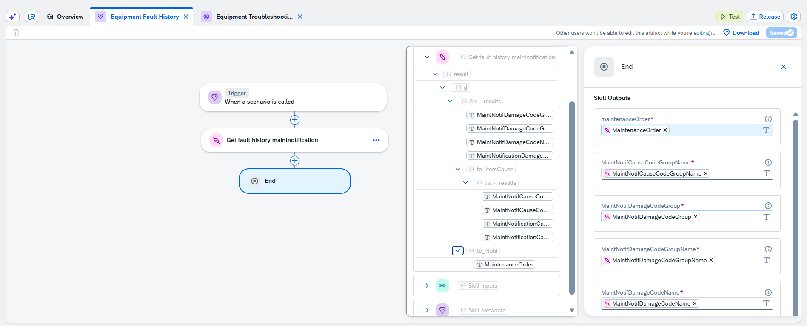

**Release Note**
```
Initial release of Equipment Fault History skill.
```

---

## Skill 2 — Get Spare Parts

**Name**
```
Get Spare Parts
```

**Identifier**
```
getSpareParts
```

**Description**
```
Retrieves spare parts for a specific maintenance order. Only invoke this skill after the user explicitly confirms they want spare part suggestions — never call it automatically. The maintenanceOrder input is always sourced from the Equipment Fault History skill response, never from the user. Invoke once per unique maintenanceOrder value. Always wait for user confirmation before calling this skill.
```

### Skill Input

| Name | Identifier | Description | Type | Required | List |
| --- | --- | --- | --- | --- | --- |
| `maintenanceOrder` | `maintenanceorder` | From Equipment Fault History skill response. | String | Yes | No |

**Input Description (copy)**
```
From Equipment Fault History skill response.
```

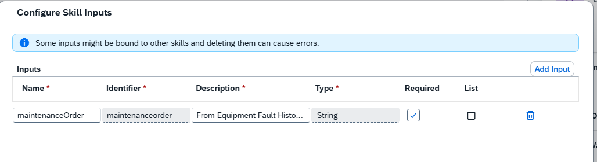

### Action

| Field | Value |
| --- | --- |
| Step Name | `get spare parts from MaintOrderOpComponent` |
| Destination Variable | `odata_dest` |

### Action Input Mapping

| Action Input Parameter | Maps To (Skill Input) |
| --- | --- |
| `maintenanceOrder` | `maintenanceOrder` |

### Skill Outputs

| Name | Identifier | Description | Type | Required | List |
| --- | --- | --- | --- | --- | --- |
| `Maintenance Order` | `maintenanceOrder` | Maintenance order number | String | Yes | No |
| `Operation` | `operation` | Operation number | String | Yes | No |
| `Plant` | `plant` | Plant code | String | Yes | No |
| `Spare Part` | `_sparePart` | Spare part | String | Yes | No |

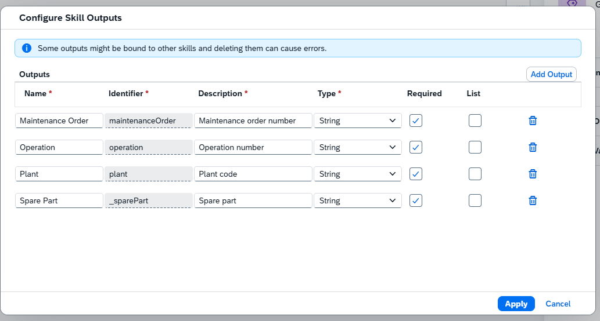

> ⚠️ The `Spare Part` identifier has a leading underscore: `_sparePart`.

### Output → Response Tree Mapping (End Node)

| Skill Output | Click this in the Skill Content tree |
| --- | --- |
| `Maintenance Order` | list - results → MaintenanceOrder |
| `Operation` | list - results → MaintenanceOrderOperation |
| `Plant` | list - results → Plant |
| `Spare Part` | list - results → Product |

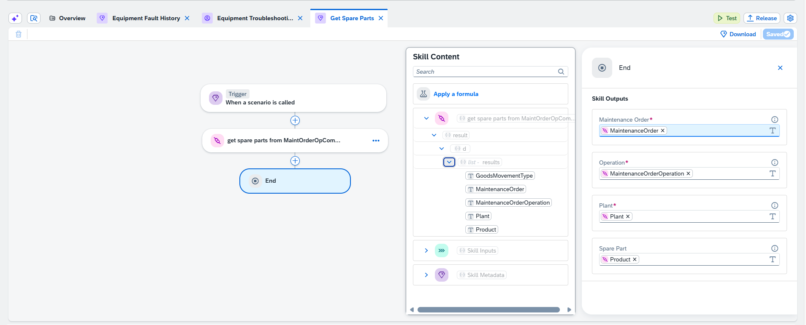

> `Product` is the key output — this is the spare part material ID that the agent passes to the Create Maintenance Work Order skill.

**Release Note**
```
Initial release of Get Spare Parts skill.
```

---

## Skill 3 — Create Maintenance Work Order

**Name**
```
Create Maintenance Work Order
```

**Identifier**
```
createMaintenanceWorkOrder
```

**Description**
```
Creates a SAP PM maintenance work order using the equipment number, spare part, damage name. Requires damage name, suggested spare part and equipment to be identified before this skill is called.
```

### Skill Inputs

| Name | Identifier | Description | Type | Required | List |
| --- | --- | --- | --- | --- | --- |
| `Equipment` | `equipment` | Equipment number for which the work order is being created. | String | Yes | No |
| `sparePart` | `_sparepart` | Spare part material number from Get Spare Parts skill. | String | Yes | No |
| `damageName` | `damagename` | Damage name faced in the equipment. | String | Yes | No |

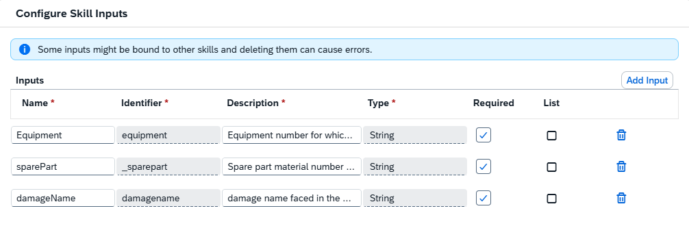

> ⚠️ Identifiers here are all lowercase (and `sparePart` gets an underscore: `_sparepart`). Match exactly what's shown above.

**Input 1 Description (copy)**
```
Equipment number for which the work order is being created.
```

**Input 2 Description (copy)**
```
Spare part material number from Get Spare Parts skill.
```

**Input 3 Description (copy)**
```
Damage name faced in the equipment.
```

### Action

| Field | Value |
| --- | --- |
| Step Name | `create workorder` |
| Destination Variable | `capm_dest` |
| Destination | `JouleSkillBackend` |

> This skill uses `capm_dest` (not `odata_dest`) because the Create Work Order API is a custom Z-service (`ZPM_WORKORDER_SRV`).

### Action Input Mapping

| Action Input Parameter | Maps To (Skill Input) |
| --- | --- |
| `damageName` | `damageName` |
| `Equipment` | `Equipment` |
| `Material` | `sparePart` |

### Skill Output

| Name | Identifier | Description | Type | Required | List |
| --- | --- | --- | --- | --- | --- |
| `Message` | `message` | Work order creation confirmation message. | String | Yes | No |

**Output Description (copy)**
```
Work order creation confirmation message.
```

### Output → Response Tree Mapping (End Node)

| Skill Output | Click this in the Skill Content tree |
| --- | --- |
| `Message` | result → message |

**Release Note**
```
Initial release of Create Maintenance Work Order skill.
```

---

## Agent — Equipment Troubleshooting Agent

In Project Overview, click **Create → Joule Agent**.

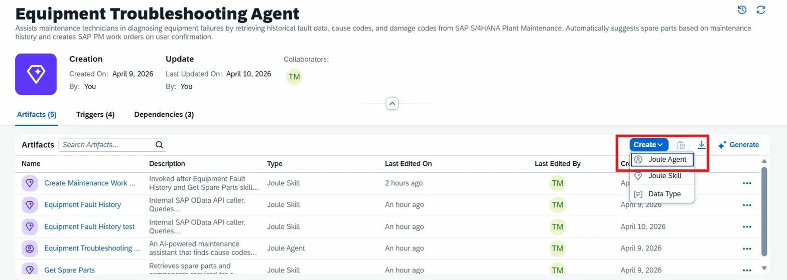

**Name**
```
Equipment Troubleshooting Agent
```

**Description**
```
An AI-powered maintenance assistant that finds cause codes and spare parts for equipment damage, and creates maintenance work orders in SAP PM
```

### Expertise

```
Equipment maintenance troubleshooting, cause code identification for a particular damage, spare parts lookup, and maintenance work order creation using SAP PM historical fault data and maintenance orders.
```

### Instructions

Copy the full block below exactly as-is into the Instructions field.

```
This is an equipment troubleshooting and maintenance assistant agent. Call this agent when the user asks about cause codes, damage reasons, spare parts, or work order creation for any equipment number.

Example queries: "What is the cause behind Bearing damage for equipment 10000148", "Find spare parts for Protective device activated on equipment 10000148", "Create a work order for equipment 10000148".

You have access to three skills:
"Equipment Fault History" - retrieves fault history, damage codes, cause codes, and linked maintenance orders.
"Get Spare Parts" - retrieves spare parts required for a specific maintenance order.
"Create Maintenance Work Order" - creates a maintenance work order in SAP PM for a specific equipment and spare part.

You will get the equipment number and damage name from the initial user input. You must orchestrate the following skills in sequence using the equipment number and damage name from the user input. At any given stage if a skill response is negative always give a clear technical reason with details in the response.

*** CRITICAL RULE: You must STOP and WAIT for the user to reply after each step below. Never proceed to the next step unless the user sends a confirmation message in a new turn. Calling the next skill without receiving user confirmation first is a strict violation. ***

--- STEP 1: EQUIPMENT FAULT HISTORY ---
Call "Equipment Fault History" with the equipment number from the user input. This skill always takes the equipment number directly from what the user provided — never ask the user for any other identifier.
The skill returns an array of historical maintenance notification records for that equipment. From this response array, extract MaintNotifDamageCodeName, MaintNotificationCauseCodeName and maintenanceOrder for each record.
Filter the array by the damage name mentioned by the user using partial matching — "Bearing" matches "Bearing Damage", "Bearing Failure" etc.
For the filtered records, identify the most frequent cause code to determine the dominant root cause, and collect all unique maintenanceOrder values linked to that damage.
If no matching damage records are found, terminate with a clear reason.
Display the maintenanceOrder values to the user in the response below. Also retain them in context — they will be used directly in Step 2.

Present ONLY this to the user and then STOP — do not call any other skill:
"For [DamageCodeName] on equipment [X] this is the cause code:
Cause Code: [MaintNotificationCauseCodeName]
Maintenance Order(s): [maintenanceOrder1, maintenanceOrder2, ...]
Do you want me to provide suggested spare parts for this?"

STOP HERE. Do not call Get Spare Parts. Do not proceed. Wait for the user's reply.

--- STEP 2: GET SPARE PARTS ---
This step only begins when the user sends a confirmation message (e.g. "yes", "find spare parts", "go ahead") in response to the Step 1 question. If the current message is the original user query — not a reply to Step 1 — do not execute this step.
Call "Get Spare Parts" using the maintenanceOrder values shown and retained from Step 1. Pass each unique maintenanceOrder as input. Call the skill once per unique maintenanceOrder — if 2 orders exist call twice, if 3 orders exist call three times.
From each response extract Product as the Spare Part. Count the frequency of each Product across all responses and select the most frequent as the suggested spare part.
If no spare parts are returned, terminate with a clear reason.

Present ONLY this to the user and then STOP — do not call any other skill:
"Suggested Spare Part for [DamageCodeName] on equipment [X]:
Spare Part: [ProductID / Product Name]
Would you like me to create a maintenance work order for this?"

STOP HERE. Do not call Create Maintenance Work Order. Do not proceed. Wait for the user's reply.

--- STEP 3: CREATE MAINTENANCE WORK ORDER ---
This step only begins when the user sends a confirmation message (e.g. "yes", "create it", "go ahead") in response to the Step 2 question. If the current message is not a reply to Step 2 — do not execute this step.
Invoke "Create Maintenance Work Order" with:
Equipment: the exact equipment number from the original user input
Material: the Product ID of the suggested spare part from Step 2

Do not ask the user for any additional input. Do not modify or reformat these values.

Present the result:
"Maintenance work order successfully created:
Problem: [DamageCodeName]
Work Order: [returned order number]
Equipment: [X]
Spare Part: [ProductID / Product Name]"

If the work order creation fails, return a clear technical reason including the error from the skill response. The agent must never end without an explicit final response.
```

### Additional Context

```
Please maintain a clear, professional, and supportive tone. This agent is designed to assist maintenance planners and operations teams in evaluating whether a maintenance order can proceed without delays due to missing materials. Recommendations should be practical, action-oriented, and phrased respectfully, especially when issues are detected. The agent must avoid vague language. If materials are unavailable, it should state so explicitly and guide the user on next steps such as procurement, stock transfer, or substitution. The overall voice should reflect operational reliability, transparency, and collaboration, aligning with values of efficiency, accountability, and continuous improvement.
```

### Tools

Open the agent → **Tools tab → Add Tool → Joule Skill** and add all three skills:

1. Equipment Fault History
2. Get Spare Parts
3. Create Maintenance Work Order

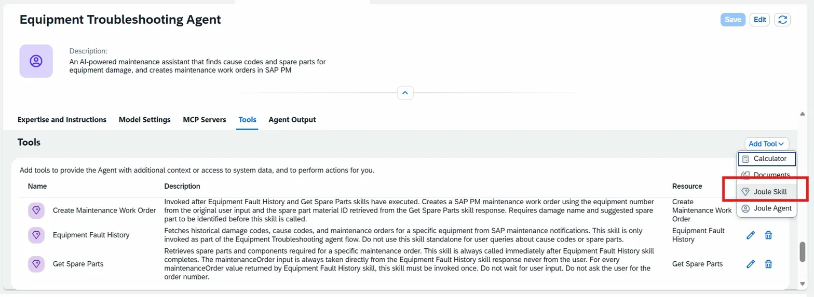

**Release Note**
```
Initial release of Equipment Troubleshooting Agent.
```

---

## Test the Agent

Click **Test** in the top-right corner of the agent canvas.

If the environment is missing, go to **Build Lobby → Control Tower → Activate Private Environment**, then return to the agent and Test.

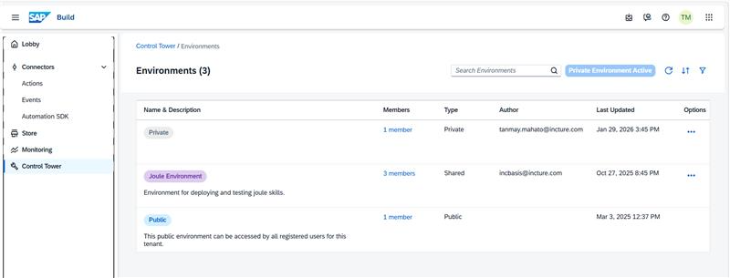

### Test dialog — Environment variables

| Variable | Destination |
| --- | --- |
| `odata_dest` | `S4H-210-Odata-Basic-Joule` |
| `capm_dest` | `JouleSkillBackend` |

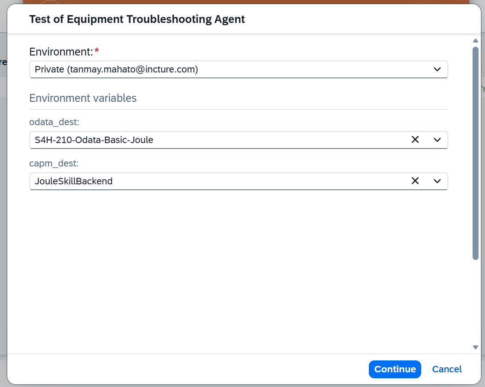

### Test Prompts

Copy these into the Test panel to validate the end-to-end flow.

```
What is the cause behind the Protective device activated damage for the equipment 10000148?
```

```
find me spare parts used in this workorder 4003196.
```

```
create a work order for the Protective device activated damage, with spare part 168 for this equipment 10000148.
```

```
What are cause codes for Bearing damage in equipment 10000148?
```

### Expected test run

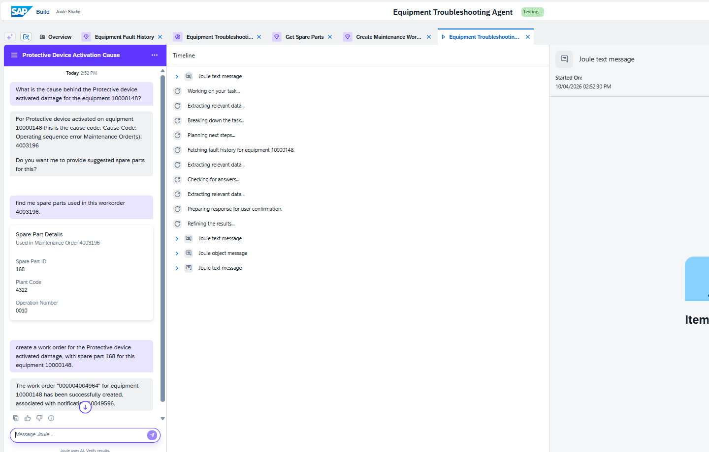

---

## Quick Reference — Destination Variables

| Used In | Variable | Destination |
| --- | --- | --- |
| Skill 1, Skill 2 | `odata_dest` | `S4H-210-Odata-Basic-Joule` |
| Skill 3 | `capm_dest` | `JouleSkillBackend` (custom Z-service `ZPM_WORKORDER_SRV`) |
